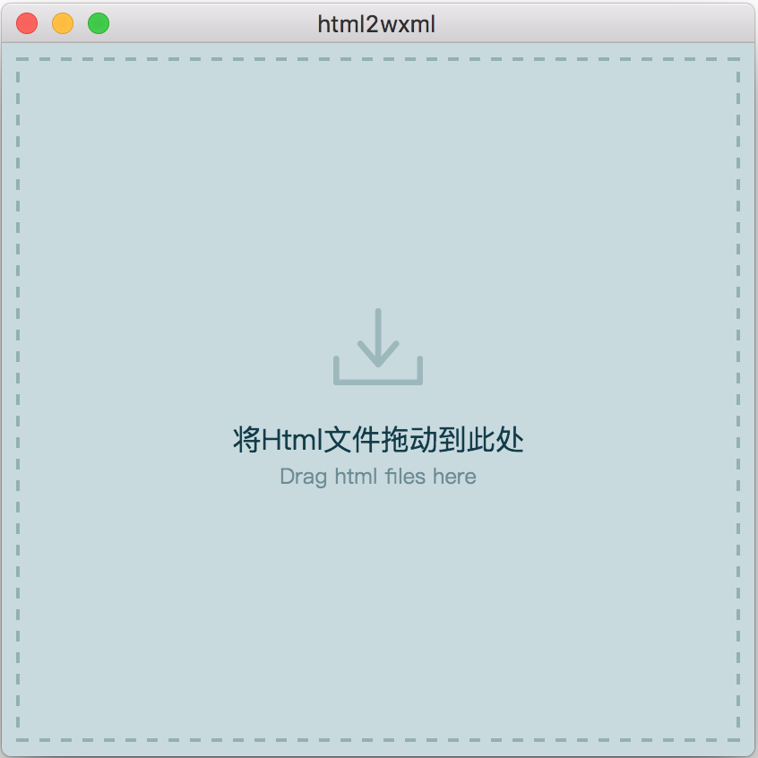

# html2wxml

**将html文件转为微信小程序使用的文件**

## 转化规则
- 将以下标签转化为`view`
`body`,`article`,`aside`,`ul`,`li`,`ol`,`caption`,`dd`,`dl`,`dt`,`footer`,`header`,`nav`,`section`,`table`,`thead`,`tbody`,`tr`,`td`,`th`,`h1`,`h2`,`h3`,`h4`,`h5`,`h6`,`div`,`p`
- 将`img`转化为`image`

- 将`a`转化为`navigator`

- 将`span`,`s`,`b`,`i`,`strong`转化为`text`

## 安装使用
下载安装成功后，将需要处理的html文件拖拽到工具界面即可自动转化，并将文件文件名后缀改为`wxml`，生成到与当前目录同级的`wxml`文件夹

** 界面预览**

## 下载
**暂时支持mac版**

[mac版](https://github.com/timezhong/html2wxml/raw/master/html2wxml-1.0.dmg)